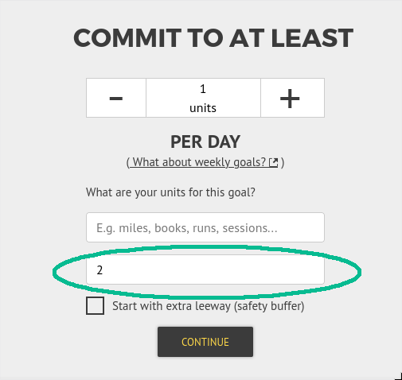
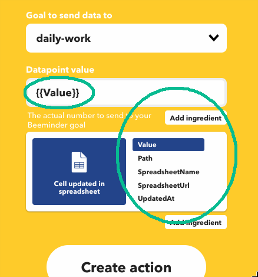

We track habit data in a Google spreadsheet; we link the spreadsheet to [Beeminder](https://www.beeminder.com/) via [IFTTT](https://ifttt.com/) to enforce completion of this habit or another. We keep forgetting how to set it up, so, for posterity:

### Setup in the sheet
You want a single cell that indicates completion. We have a column where we track daily if we did the habit and a cell that counts the number of completed cells in said column. This has to be on the first worksheet in the spreadsheet.
<figure><figcaption>Example of a tracking column with summary cell.</figcaption></figure>

### Setup in Beeminder
1. New goal. 
2. Don't pick auto IFTTT data entry; pick the manual option instead. <figure></figure>
3. Pick ODOMETER goal type (since for us our summary cells contain a count or total). <figure></figure>
4. Make sure you fill in current value in the summary cell. <figure></figure>
5. Finish goal setup as you like.

### Setup in IFTTT
1. New applet.
2. Google Sheets for If service.
3. 'cell updated in spreadsheet' trigger. <figure></figure>
4. Enter path to your spreadsheet and the summary cell. <figure></figure>
5. Beeminder for Then service.
6. 'add datapoint' action. <figure></figure>
7. Datapoint value is the {{Value}} ingredient. <figure></figure>
8. Finish applet creation as you like.